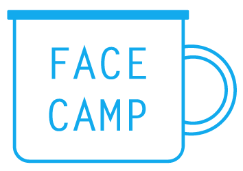

<p align="center">
  
</p>

# [face.camp](https://face.camp)

Facecamp lets you take an animated gif from desktop or mobile by connecting the app to Slack and then visiting [face.camp](https://face.camp) to post yourself to Slack for your teamies to see.

## Developing Locally

First run `npm install` in the project root.

### Using a Legacy Token

The easiest way to get up and running with this locally is to use a legacy token. [Follow the instructions on this page](https://api.slack.com/custom-integrations/legacy-tokens) to obtain a legacy token for your user and team. Note that you should only use a legacy token for playing around with this project locally, not for deploying a version for yourself. See the next section for instructions on how to do that.

Once you have a legacy token you can use it to start the app:

```sh
LEGACY_TOKEN=<TOKEN> npm start
```

### Using a Slack app

If you'd like to use your own Slack app to run this project, that's possible too. [Go to your Slack app's page](https://api.slack.com/apps) to get or create your app. Then use the configuration values for that app to setup and run [the authentication lambda functions](./functions).

## Building for Production

This app gets built as static files that can be hosted anywhere. Run the following commands to build a production ready version to the `build/` directory.

```sh
npm run build
```

If you'd like to test the production version locally, you can run the following command which will serve whatever files are in the `build/` directory.

```sh
npm run serve
```

## Contributing

Follow the guidelines in the [contribution docs](./docs/CONTRIBUTING.md).

## Credit

Credit to [@latentflip's](https://github.com/latentflip) [gifhu.gs](https://github.com/latentflip/gifhu.gs) from which I took the initial implementation for the getUserMedia -> gif code.

## License

MIT
